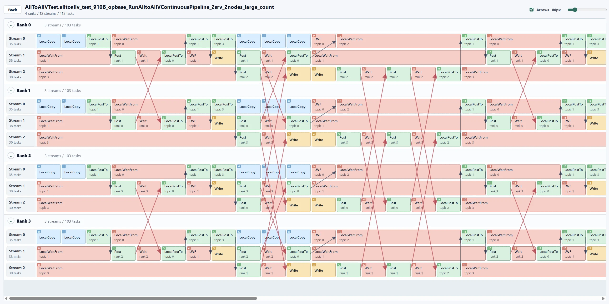

# Hccl Checker Visualizer

Hccl Checker Visualizer 是一个用于解析 HcclChecker ST 日志并可视化展示 task 流水的本地前端工具。将 `build.sh --open_hccl_test` 产生的 `st.log` 上传到页面后，可以按 test case 查看 rank、stream、task、Wait/Post 关系以及 local 与跨 rank 的 Notify/Wait 关系箭头，辅助定位 HcclChecker 报出的通信编排问题。

日志解析在浏览器本地完成，项目不依赖后端服务。



## 本地部署

### 环境要求

- Node.js `^20.19.0` 或 `>=22.12.0`
- npm

当前项目已在以下环境验证：

```bash
node --version
npm --version
```

### 安装依赖

```bash
npm install
```

### 启动开发服务

```bash
npm run dev
```

Vite 默认会输出本地访问地址，通常是：

```text
http://localhost:5173/
```

打开页面后，点击 `Upload ST log` 或直接将 `.log` / `.txt` 日志文件拖入上传区域。

### 构建生产版本

```bash
npm run build
```

构建产物会输出到 `dist/`。

### 本地预览生产版本

```bash
npm run preview
```

### 代码检查

```bash
npm run lint
```

## 使用方式

1. 获取 HcclChecker 测试日志，例如 `st.log`。
2. 启动本项目并打开页面。
3. 上传 `st.log`。
4. 在 test case 列表中选择需要分析的用例。
5. 在详情页查看 rank / stream / task 时间线。

详情页支持：

- 展示每个 rank 和 stream 上的 task 顺序。
- 标记无法匹配的 Wait / Post 关系。
- 使用 `Arrows` 开关显示或隐藏 local 与跨 rank 的 Notify/Wait 关系箭头。
- 使用滑块调整 task block 宽度。
- 使用 `W` / `S` 快捷键放大或缩小 task block 宽度。
- 点击 rank 行折叠或展开对应 rank。

## 获取 HcclChecker 测试报告

### hcomm 仓

参考仓库：https://gitcode.com/cann/hcomm

在 hcomm 仓中，将想分析的 test case 插入 `checker.EnableTaskPrint()`。当 checker 检查出错误时，终端会打印 checker 日志；本项目可以解析这部分日志并做可视化展示。

例如，目标用例可以位于 hcomm 仓内的相对路径：

```text
test/st/algorithm/testcase/testcase/testcase_all_to_allv.cc
```

可以按下面方式在目标 ST 用例中打开 task 打印。下面代码是简化示例，实际用例名称、变量名、初始化流程和断言请以 hcomm 仓内现有用例为准。

```cpp
TEST_F(AllToAllVTest, target_test_case)
{
    Checker checker;
    HcclResult ret;

    // 打开 task 打印，checker 发现错误时会把 rank / stream / task 信息打印到终端。
    checker.EnableTaskPrint();

    ret = checker.Check(checkerOpParam, topoMeta);

    EXPECT_EQ(ret, HCCL_SUCCESS);
}
```

运行 ST 并保存日志：

```bash
bash build.sh --open_hccl_test | tee st.log
```

如果 checker 检查出错误，`st.log` 中会包含类似下面的 task 打印内容：

```text
rank id is 0
[rankId:0, queueId:0, index:0] NotifyRecord[...]
[rankId:0, queueId:0, index:1] Wait[...]
```

将生成的 `st.log` 上传到 Hccl Checker Visualizer，即可查看解析后的 test case 列表和 task 时间线。

## 日志格式要求

解析器依赖以下信息识别 test case 和 task：

- GoogleTest 风格的用例开始行，例如 `[ RUN      ] SuiteName.case_name`。
- rank 段落头，例如 `rank id is 0`。
- task 行，例如 `[rankId:0, queueId:0, index:1] Wait[...]`。
- GoogleTest 风格的用例结束行，例如 `[       OK ] SuiteName.case_name (123 ms)` 或 `[  FAILED  ] SuiteName.case_name (123 ms)`。

仓内提供了示例日志：

```text
examples/sample_log.txt
```
